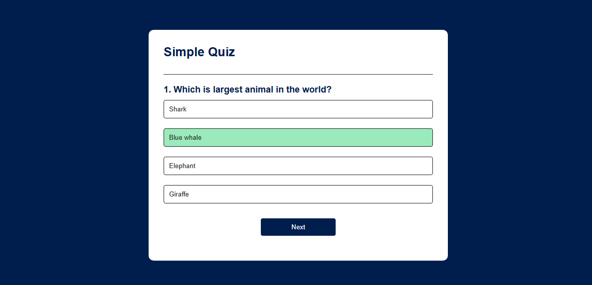

# 🧠 Simple Quiz App

A fun and interactive JavaScript quiz application that lets users answer multiple-choice questions and get immediate feedback. Built using HTML, CSS, and JavaScript.

---

## 🚀 Features

- ✅ Multiple-choice questions
- ✅ Real-time feedback (correct/incorrect)
- ✅ Score tracking
- ✅ "Next" and "Play Again" functionality

---

## 📸 Screenshot




---

## 🛠️ Technologies Used

- HTML5
- CSS3
- JavaScript 

---

## 📂 Project Structure
```vscode
quiz-app/
│
├── index.html # Main HTML structure
├── style.css # Styling for quiz layout and popup
├── script.js # JavaScript logic (questions, scoring, animations)
└── screenshot.png # Optional screenshot preview
```

---

## 📦 Getting Started

1. Clone the repo
   ```bash
   git clone https://github.com/yourusername/quiz_app_javascript.git
   ```
2. Navigate to the project folder
  ```bash
  cd quiz_app_javascript
  ```
3. Open index.html in your browser
   You can simply double-click the file or use Live Server if using VS Code.

 ## 🎉 Customization
✏️ Add your own questions:
Edit the questions array inside script.js

🎨 Change the design:
Modify styles in style.css

💥 Add confetti or sound effects:
Extend the showScore() or selectAnswer() functions

## 🤝 Contributing
Pull requests are welcome. Feel free to open issues or suggest features!
## ✨ Credits
Created by Ellias Sithole — built as a practice project using basic web technologies.
