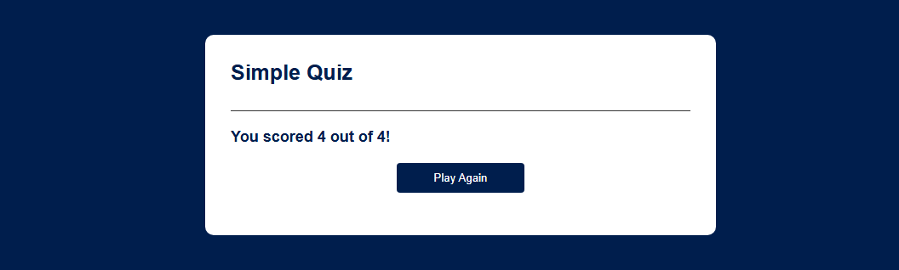

# 🧠 Simple Quiz App

A fun and interactive JavaScript quiz application that lets users answer multiple-choice questions and get immediate feedback. Built using HTML, CSS, and JavaScript.

---

## 🚀 Features

- ✅ Multiple-choice questions
- ✅ Real-time feedback (correct/incorrect)
- ✅ Score tracking
- ✅ "Next" and "Play Again" functionality

---

## 📸 Screenshot




---

## 🛠️ Technologies Used

- HTML5
- CSS3
- JavaScript 

---
## 🧠 Quiz Game App Logic (JavaScript)

This is a multiple-choice quiz game built with vanilla JavaScript. It dynamically displays questions, tracks user scores, gives visual feedback on answers, and lets users replay the game.

```javascript
// List of quiz questions and answer options
const questions = [
  {
    question: "Which is largest animal in the world?",
    answers: [ 
      {text: 'Shark', correct: false},
      {text: 'Blue whale', correct: true},
      {text: 'Elephant', correct: false},
      {text: 'Giraffe', correct: false},
    ] 
  },
  {
    question: "What is the smallest country in the world?",
    answers: [
      {text: 'Vatican City', correct: true},
      {text: 'Bhutan', correct: false},
      {text: 'Nepal', correct: false},
      {text: 'Shri Lanka', correct: false},
    ]
  },
  {
    question: "What is the largest desert in the world?",
    answers: [
      {text: 'Kalahari', correct: false},
      {text: 'Gobi', correct: false},
      {text: 'Sahara', correct: false},
      {text: 'Antarctica', correct: true},
    ]
  },
  {
    question: "What is the smallest continent in the world?",
    answers: [
      {text: 'Asia', correct: false},
      {text: 'Australia', correct: true},
      {text: 'Arctic', correct: false},
      {text: 'Africa', correct: false},
    ]
  }
];

// DOM element references
const questionElement = document.getElementById('question');
const answerButtons = document.getElementById('answer-buttons');
const nextButton = document.getElementById('next-btn');

let currentQuestionIndex = 0;
let score = 0;

// Start or restart the quiz
function startQuiz() {
  currentQuestionIndex = 0;
  score = 0;
  nextButton.innerHTML = 'Next';
  showQuestion();
}

// Display the current question and answer options
function showQuestion() {
  resetState();
  let currentQuestion = questions[currentQuestionIndex];
  let questionNo = currentQuestionIndex + 1;
  questionElement.innerHTML = questionNo + '. ' + currentQuestion.question;

  // Create answer buttons
  currentQuestion.answers.forEach(answer => {
    const button = document.createElement('button');
    button.innerHTML = answer.text;
    button.classList.add('btn');
    answerButtons.appendChild(button);
    if (answer.correct) {
      button.dataset.correct = answer.correct;
    }
    button.addEventListener('click', selectAnswer);
  });
}

// Clear previous answer buttons and hide Next button
function resetState() {
  nextButton.style.display = 'none';
  while (answerButtons.firstChild) {
    answerButtons.removeChild(answerButtons.firstChild);
  }
}

// Handle answer selection and update score
function selectAnswer(e) {
  const selectedBtn = e.target;
  const isCorrect = selectedBtn.dataset.correct === 'true';

  if (isCorrect) {
    selectedBtn.classList.add('correct');
    score++;
  } else {
    selectedBtn.classList.add('incorrect');
  }

  // Highlight all correct answers and disable all buttons
  Array.from(answerButtons.children).forEach(button => {
    if (button.dataset.correct === 'true') {
      button.classList.add('correct');
    }
    button.disabled = true;
  });

  nextButton.style.display = 'block';
}

// Show final score when quiz ends
function showScore() {
  resetState();
  questionElement.innerHTML = `You scored ${score} out of ${questions.length}!`;
  nextButton.innerHTML = 'Play Again';
  nextButton.style.display = 'block';
}

// Handle navigation to next question or show score
function handleNextButton() {
  currentQuestionIndex++;
  if (currentQuestionIndex < questions.length) {
    showQuestion();
  } else {
    showScore();
  }
}

// Next button click logic
nextButton.addEventListener('click', () => {
  if (currentQuestionIndex < questions.length) {
    handleNextButton();
  } else {
    startQuiz();
  }
});

startQuiz(); // Initialize quiz on page load
```

## 📂 Project Structure
```vscode
quiz-app/
│
├── index.html # Main HTML structure
├── style.css # Styling for quiz layout and popup
├── script.js # JavaScript logic (questions, scoring, animations)
└── screenshot.png # Optional screenshot preview
```

---

## 📦 Getting Started

1. Clone the repo
   ```bash
   git clone https://github.com/yourusername/quiz_app_javascript.git
   ```
2. Navigate to the project folder
  ```bash
  cd quiz_app_javascript
  ```
3. Open index.html in your browser
   You can simply double-click the file or use Live Server if using VS Code.

 ## 🎉 Customization
✏️ Add your own questions:
Edit the questions array inside script.js

🎨 Change the design:
Modify styles in style.css

💥 Add confetti or sound effects:
Extend the showScore() or selectAnswer() functions

## 🤝 Contributing
Pull requests are welcome. Feel free to open issues or suggest features!
## ✨ Credits
Created by Ellias Sithole — built as a practice project using basic web technologies.
